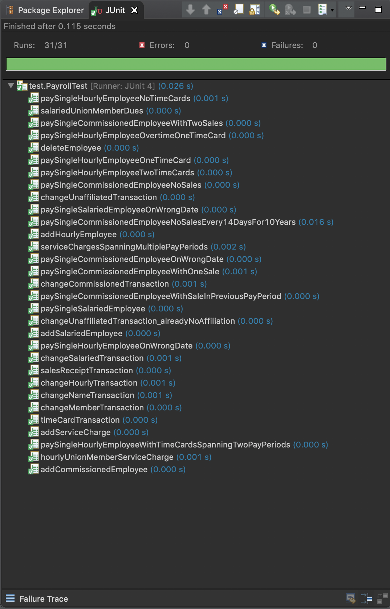

# Payroll Case Study

### This program is a Java implementation of Payroll Case Study from the book Agile Software Development: Principles, Patterns, and Practices by Robert C. Martin (Uncle Bob).

## JUnit

### Members:
Theeruth Borisuth 5910545701

Nitith   Chayakul 5910545736
